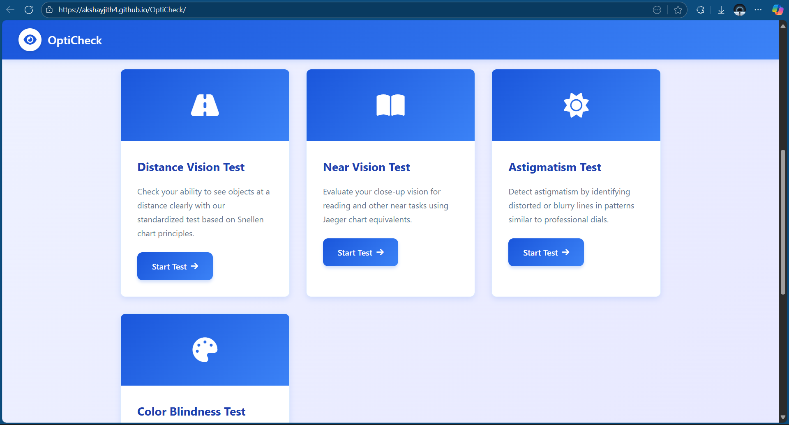

# 👁️ OptiCheck

**OptiCheck** is a professional-grade web application designed to help you monitor your visual health from the comfort of your home. It features clinically-inspired vision tests that provide insights into various aspects of your eye health.

🔗 [Live Demo](https://akshayjith4.github.io/OptiCheck/)

---

## 📋 Features

- **Distance Vision Test**: Assess your ability to see distant objects clearly using Snellen chart principles.
- **Near Vision Test**: Evaluate your close-up vision for reading and near tasks using standard test equivalents.
- **Astigmatism Test**: Detect astigmatism by identifying blurred or distorted patterns.
- **Color Blindness Test**: Identify color vision deficiencies using Ishihara plates.
- **Fun Eye Facts**: Learn interesting and surprising facts about eye health and vision science.

---

## 🚀 Getting Started

To run the project locally:

1. Clone the repository:

   ```bash
   git clone https://github.com/akshayjith4/OptiCheck.git
   ```
2. Navigate to the project directory:
    cd OptiCheck

3. Open index.html in your web browser.

 🛠️ Built With
    HTML5
    CSS3
    JavaScript
    GitHub Pages - for deployment

## 📸 Screenshot



## 🧠 Did You Know?
Eye tests can detect schizophrenia with up to 98.3% precision using simple eye movement exams.

## 📌 Contributing
Contributions are welcome! Feel free to fork the repository, open an issue, or submit a pull request.

## 📄 License
This project is open source and available under the MIT License
.

## 👤 Author
[Akshayjith](https://github.com/akshayjith4)

## 📬 Contact
For any questions or suggestions, feel free to reach out via GitHub Issues.

Let me know if you'd like this customized further (e.g., badges, deployment instructions, or linking to a `LICENSE` file).
